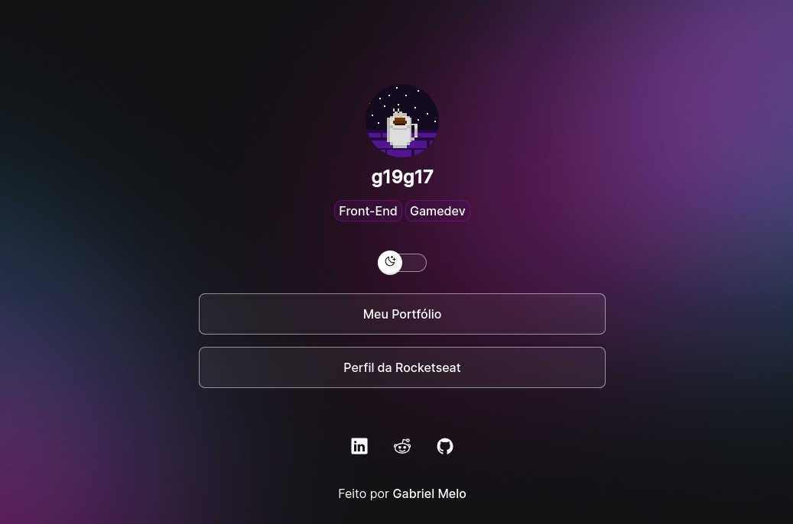
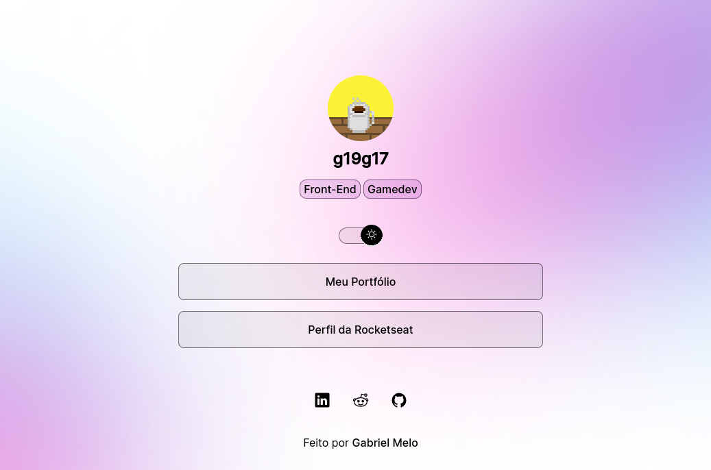
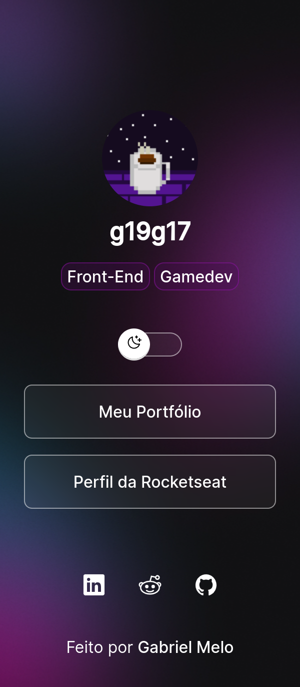
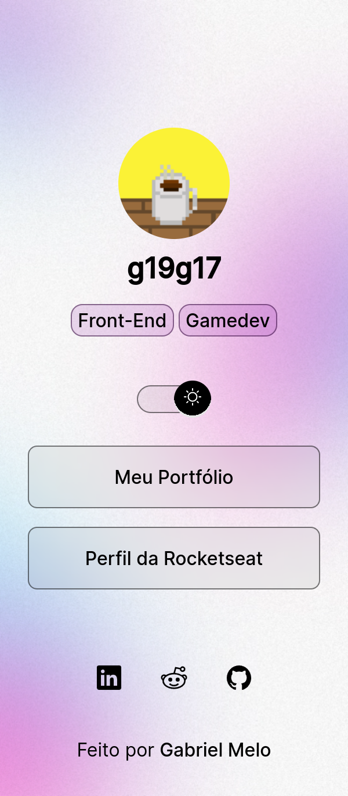

<h1 align="center"> DevLinks </h1>

Curso gratuito promovido pela Rocketseat.

## Preview:

---

 

  

  

  

  

## 🚀 Tecnologias Usadas:
---

- HTML e CSS
- JavaScript 
- Git e Github

## 💻 Descrição
---

Página de amostra de perfil/portfólio criada no curso online e gratuito promovido pela Rocketseat, plataforma de ensino de Desenvolvimendo WEB

